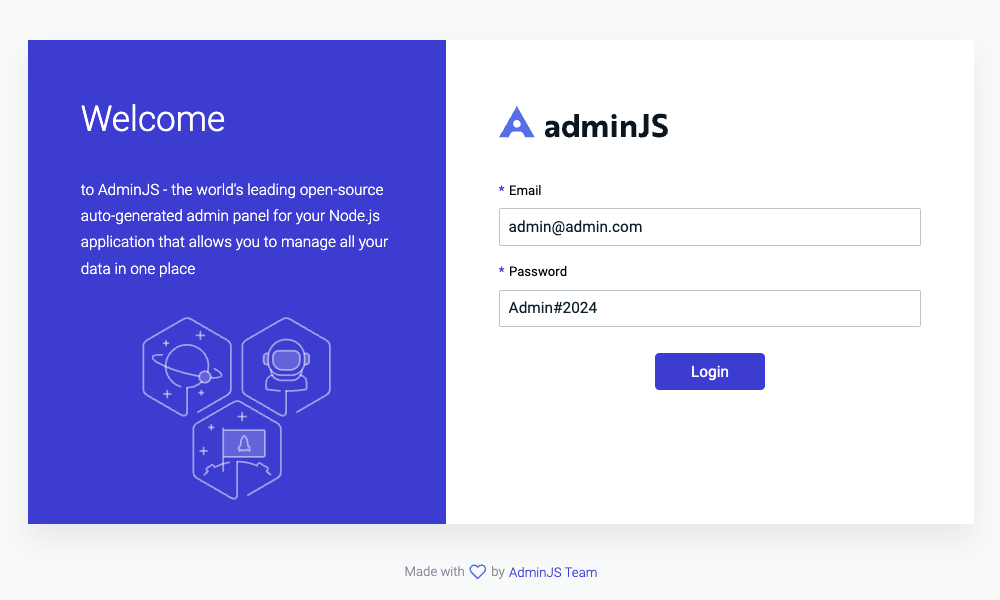
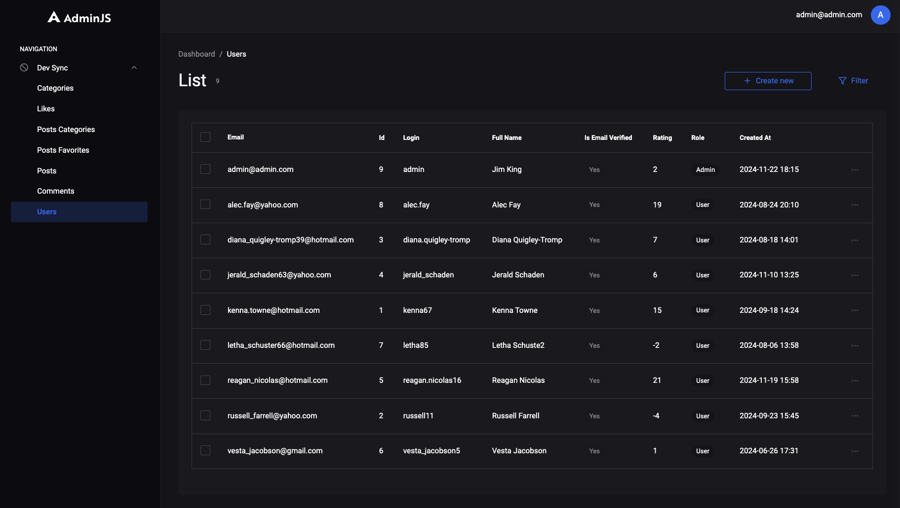

# DevSync API

## Description
This project is a backend API developed using Express.js for a platform called DevSync, inspired by Stack Overflow. 
The API provides functionality for users to register, log in, create questions, comment, like or dislike posts, and manage various interactions within the platform.

## Requirements
- **Node.JS** >= v22
- **NPM** >= v10
- **MySQL** >= 8.0

> 🏗️ Make sure all the necessary technologies are installed before getting started.

## Database Install
The database schema is located in the [database/schema.sql](database/schema.sql) file. Execute the SQL commands in your MySQL database to create the necessary tables.

## Steps to Set Up the Project
1. Clone this repository to your local machine and navigate to the project directory.
   ```bash
   git clone <repository-url>
   ```
2. Run the appropriate package manager command to install all required dependencies.
   ```bash
   npm install
   ```
5. Update the `.env` file with your MySQL database credentials to set up the database connection. Example:
   ```text
   DB_USER=root
   DB_PASSWORD=root
   DB_HOST=localhost
   DB_PORT=3306
   ```

6. Log in to your MySQL instance and execute the database schema. 
7. Copy the contents of the [database/schema.sql](database/schema.sql) file and run it in your MySQL database.
Alternatively, execute the SQL commands directly via the MySQL CLI using the following command: `mysql -u {USER_NAME} -p < database/schema.sql`. Replace `{USER_NAME}` with your MySQL username and provide your password when prompted.
8. Follow the same steps as in Step 4, but use the [database/data.sql](database/data.sql)  file to populate the database with initial data.
9. Run the server to start the application.
   ```bash
   npm run start
   ```

## Using Ethereal for Email Testing
[Ethereal](https://ethereal.email/) is a free fake SMTP service for testing email functionality (e.g., with Nodemailer). To view the test emails generated by the application. Log in to Ethereal using the provided test credentials.
```text
login: martina.parisian90@ethereal.email
password: 6WmrYJ3bGkDqx3jWxq
```

## API Documentation
The documentation for all available endpoints is accessible at [http://localhost:8080/swagger-docs/](http://localhost:8080/swagger-docs/). This documentation is generated using the [Swagger](https://swagger.io/).

## Admin Panel
Access the admin panel at [http://localhost:8080/admin/](http://localhost:8080/admin/), built using the [AdminJS](https://adminjs.co/).





## Additional Features
### Favorite Posts
Users can add posts to their favorites and view the list of their favorite posts.

### Best Comment
Post authors can mark a comment as the most useful one that solved their problem. Only the author of a post has this privilege.

### Most Interesting Posts
Administrators can select posts to feature on the site’s main page, typically showcasing the most engaging content.

## Test Users
- All users with the `user` role have the default password: `User#2024`. These are mock users created for demonstration purposes.
- Admin credentials
```text
   login: admin
   password: admin@admin.com
   password: Admin#2024
```
   
